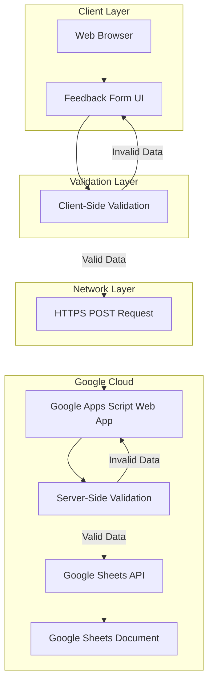
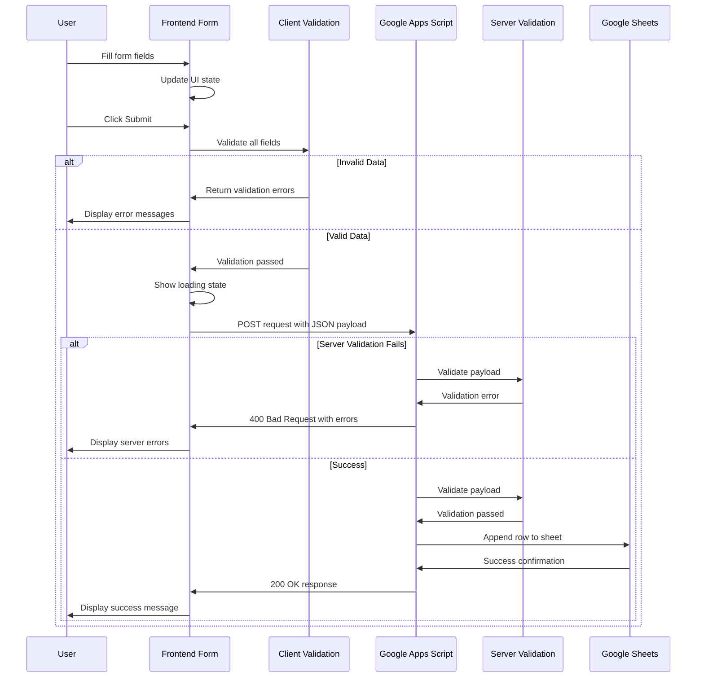
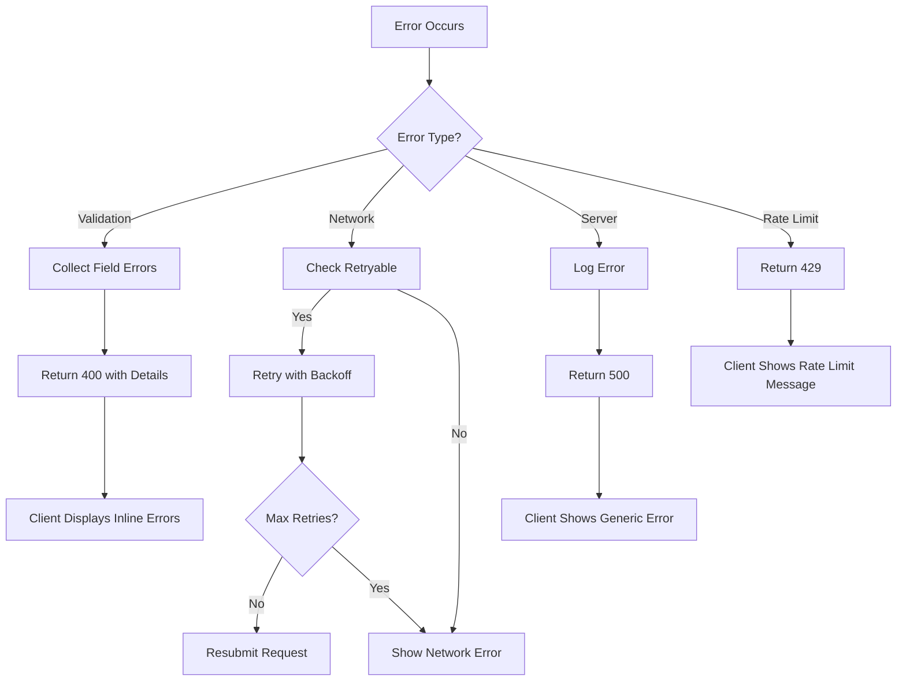
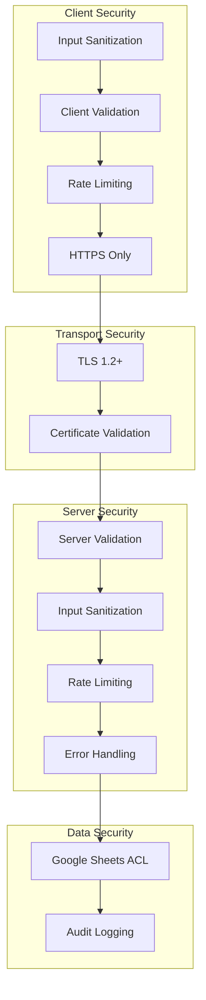

# Feedback System Architecture

## Table of Contents
1. [System Overview](#1-system-overview)
2. [Data Flow Diagram](#2-data-flow-diagram)
3. [API Endpoint Specification](#3-api-endpoint-specification)
4. [Google Sheets Structure](#4-google-sheets-structure)
5. [Validation Rules](#5-validation-rules)
6. [Error Handling Strategy](#6-error-handling-strategy)
7. [Security Considerations](#7-security-considerations)

---

## 1. System Overview

### 1.1 Purpose
The Feedback System provides a mechanism for users to submit feedback through a web form, with data persisted to Google Sheets via a Google Apps Script backend. This serverless architecture eliminates the need for traditional backend infrastructure while maintaining reliability and data integrity.

### 1.2 Components

| Component | Technology | Purpose |
|-----------|------------|---------|
| Frontend Form | HTML/CSS/JavaScript | User interface for feedback submission |
| Backend API | Google Apps Script | Web app endpoint handling POST requests |
| Data Store | Google Sheets | Persistent storage for feedback records |

### 1.3 Architecture Diagram



### 1.4 Key Design Decisions

1. **Serverless Architecture**: Google Apps Script provides free hosting and automatic scaling
2. **Dual Validation**: Both client and server-side validation ensure data integrity
3. **CORS Support**: Backend configured for cross-origin requests from any domain
4. **No Authentication**: Public submission endpoint with rate limiting via Google quotas

---

## 2. Data Flow Diagram

### 2.1 Submission Flow



### 2.2 Data Transformation Pipeline

```mermaid
flowchart LR
    subgraph Input
        A[Form Data]
    end
    
    subgraph Client Processing
        B[Collect Field Values]
        C[Validate Fields]
        D[Generate Timestamp]
        E[Create JSON Payload]
    end
    
    subgraph Transmission
        F[HTTPS POST]
    end
    
    subgraph Server Processing
        G[Parse JSON]
        H[Validate Payload]
        I[Sanitize Input]
        J[Format for Storage]
    end
    
    subgraph Storage
        K[Append to Sheet]
    end
    
    A --> B --> C --> D --> E --> F --> G --> H --> I --> J --> K
```



---

## 3. API Endpoint Specification

### 3.1 Endpoint Details

| Property | Value |
|----------|-------|
| URL | `https://script.google.com/macros/s/{SCRIPT_ID}/exec` |
| Method | `POST` |
| Content-Type | `application/json` |
| Accept | `application/json` |

### 3.2 Request Payload

```json
{
  "feedbackType": "bug_report",
  "email": "user@example.com",
  "content": "The application crashes when I try to export data.",
  "timestamp": "2026-02-24T12:00:00.000Z",
  "metadata": {
    "userAgent": "Mozilla/5.0...",
    "referrer": "https://example.com/feedback",
    "screenResolution": "1920x1080"
  }
}
```

### 3.3 Request Fields Specification

| Field | Type | Required | Description |
|-------|------|----------|-------------|
| `feedbackType` | string | Yes | Type of feedback. Enum: `bug_report`, `feature_request`, `general_feedback`, `other` |
| `email` | string | Yes | Submitter email address. RFC 5322 compliant format |
| `content` | string | Yes | Feedback content. Minimum 10 characters |
| `timestamp` | string | Yes | ISO 8601 UTC timestamp from client |
| `metadata` | object | No | Additional client information for debugging |

### 3.4 Response Formats

#### Success Response (200 OK)
```json
{
  "success": true,
  "message": "Feedback submitted successfully",
  "data": {
    "recordId": "row_123",
    "submittedAt": "2026-02-24T12:00:01.000Z"
  }
}
```

#### Validation Error Response (400 Bad Request)
```json
{
  "success": false,
  "error": {
    "code": "VALIDATION_ERROR",
    "message": "Invalid request payload",
    "details": [
      {
        "field": "email",
        "message": "Invalid email format"
      },
      {
        "field": "content",
        "message": "Content must be at least 10 characters"
      }
    ]
  }
}
```

#### Server Error Response (500 Internal Server Error)
```json
{
  "success": false,
  "error": {
    "code": "INTERNAL_ERROR",
    "message": "An unexpected error occurred. Please try again later."
  }
}
```

### 3.5 HTTP Status Codes

| Status Code | Meaning | When Used |
|-------------|---------|-----------|
| 200 | OK | Successful submission |
| 400 | Bad Request | Validation failure |
| 405 | Method Not Allowed | Non-POST request |
| 429 | Too Many Requests | Rate limit exceeded |
| 500 | Internal Server Error | Unexpected server error |

---

## 4. Google Sheets Structure

### 4.1 Sheet Configuration

| Property | Value |
|----------|-------|
| Sheet Name | `Feedback Submissions` |
| Header Row | Row 1 (frozen) |
| Data Start Row | Row 2 |

### 4.2 Column Schema

| Column | Header | Data Type | Width | Description |
|--------|--------|-----------|-------|-------------|
| A | `ID` | Auto-increment | 80px | Unique record identifier |
| B | `Timestamp` | DateTime | 150px | Submission timestamp in ISO 8601 |
| C | `Feedback Type` | String | 120px | Category of feedback |
| D | `Email` | String | 200px | Submitter email address |
| E | `Content` | String | 400px | Feedback message content |
| F | `User Agent` | String | 250px | Client browser information |
| G | `Referrer` | String | 200px | Source page URL |
| H | `Screen Resolution` | String | 100px | Client screen dimensions |
| I | `Status` | String | 100px | Processing status |
| J | `Notes` | String | 200px | Internal notes |

### 4.3 Data Validation Rules in Sheets

| Column | Data Validation |
|--------|-----------------|
| C | Dropdown: `Bug Report`, `Feature Request`, `General Feedback`, `Other` |
| I | Dropdown: `New`, `In Progress`, `Resolved`, `Closed` |

### 4.4 Conditional Formatting

| Rule | Condition | Format |
|------|-----------|--------|
| New items | Column I = `New` | Green background |
| In Progress | Column I = `In Progress` | Yellow background |
| Resolved | Column I = `Resolved` | Gray background |
| Bug Reports | Column C = `Bug Report` | Red text |

### 4.5 Sample Data Row

| ID | Timestamp | Feedback Type | Email | Content | User Agent | Referrer | Screen Resolution | Status | Notes |
|----|-----------|---------------|-------|---------|------------|----------|-------------------|--------|-------|
| 1 | 2026-02-24T12:00:00Z | Bug Report | user@example.com | App crashes on export | Mozilla/5.0... | https://app.com | 1920x1080 | New | |

---

## 5. Validation Rules

### 5.1 Client-Side Validation

#### 5.1.1 Feedback Type Validation
```javascript
// Validation Rule
const VALID_FEEDBACK_TYPES = [
  'bug_report',
  'feature_request', 
  'general_feedback',
  'other'
];

// Must be one of the predefined types
function validateFeedbackType(value) {
  return VALID_FEEDBACK_TYPES.includes(value);
}
```

#### 5.1.2 Email Validation (RFC 5322 Compliant)
```javascript
// RFC 5322 compliant email regex
const EMAIL_REGEX = /^[a-zA-Z0-9.!#$%&'*+/=?^_`{|}~-]+@[a-zA-Z0-9](?:[a-zA-Z0-9-]{0,61}[a-zA-Z0-9])?(?:\.[a-zA-Z0-9](?:[a-zA-Z0-9-]{0,61}[a-zA-Z0-9])?)*$/;

function validateEmail(email) {
  if (!email || email.trim().length === 0) {
    return { valid: false, message: 'Email is required' };
  }
  if (email.length > 254) {
    return { valid: false, message: 'Email must be less than 254 characters' };
  }
  if (!EMAIL_REGEX.test(email)) {
    return { valid: false, message: 'Invalid email format' };
  }
  return { valid: true };
}
```

#### 5.1.3 Content Validation
```javascript
const MIN_CONTENT_LENGTH = 10;
const MAX_CONTENT_LENGTH = 5000;

function validateContent(content) {
  if (!content || content.trim().length === 0) {
    return { valid: false, message: 'Feedback content is required' };
  }
  if (content.trim().length < MIN_CONTENT_LENGTH) {
    return { valid: false, message: `Content must be at least ${MIN_CONTENT_LENGTH} characters` };
  }
  if (content.length > MAX_CONTENT_LENGTH) {
    return { valid: false, message: `Content must not exceed ${MAX_CONTENT_LENGTH} characters` };
  }
  return { valid: true };
}
```

#### 5.1.4 Timestamp Validation
```javascript
function validateTimestamp(timestamp) {
  if (!timestamp) {
    return { valid: false, message: 'Timestamp is required' };
  }
  
  const date = new Date(timestamp);
  if (isNaN(date.getTime())) {
    return { valid: false, message: 'Invalid timestamp format' };
  }
  
  // Ensure timestamp is not in the future
  if (date.getTime() > Date.now()) {
    return { valid: false, message: 'Timestamp cannot be in the future' };
  }
  
  // Ensure timestamp is within reasonable range (not older than 1 hour)
  const oneHourAgo = Date.now() - (60 * 60 * 1000);
  if (date.getTime() < oneHourAgo) {
    return { valid: false, message: 'Timestamp is too old' };
  }
  
  return { valid: true };
}
```

### 5.2 Server-Side Validation

#### 5.2.1 Complete Payload Validation
```javascript
// Google Apps Script validation function
function validatePayload(payload) {
  const errors = [];
  
  // Required fields check
  const requiredFields = ['feedbackType', 'email', 'content', 'timestamp'];
  for (const field of requiredFields) {
    if (!payload[field]) {
      errors.push({ field, message: `${field} is required` });
    }
  }
  
  // Feedback type validation
  const validTypes = ['bug_report', 'feature_request', 'general_feedback', 'other'];
  if (payload.feedbackType && !validTypes.includes(payload.feedbackType)) {
    errors.push({ field: 'feedbackType', message: 'Invalid feedback type' });
  }
  
  // Email validation
  if (payload.email) {
    const emailRegex = /^[a-zA-Z0-9.!#$%&'*+/=?^_`{|}~-]+@[a-zA-Z0-9](?:[a-zA-Z0-9-]{0,61}[a-zA-Z0-9])?(?:\.[a-zA-Z0-9](?:[a-zA-Z0-9-]{0,61}[a-zA-Z0-9])?)*$/;
    if (!emailRegex.test(payload.email)) {
      errors.push({ field: 'email', message: 'Invalid email format' });
    }
    if (payload.email.length > 254) {
      errors.push({ field: 'email', message: 'Email too long' });
    }
  }
  
  // Content validation
  if (payload.content) {
    if (payload.content.trim().length < 10) {
      errors.push({ field: 'content', message: 'Content too short' });
    }
    if (payload.content.length > 5000) {
      errors.push({ field: 'content', message: 'Content too long' });
    }
  }
  
  // Timestamp validation
  if (payload.timestamp) {
    const date = new Date(payload.timestamp);
    if (isNaN(date.getTime())) {
      errors.push({ field: 'timestamp', message: 'Invalid timestamp' });
    }
  }
  
  return {
    isValid: errors.length === 0,
    errors: errors
  };
}
```

### 5.3 Validation Summary Table

| Field | Client Validation | Server Validation | Error Message |
|-------|-------------------|-------------------|---------------|
| feedbackType | Required, enum check | Required, enum check | Please select a feedback type |
| email | Required, RFC 5322 format, max 254 chars | Same as client | Please enter a valid email address |
| content | Required, min 10 chars, max 5000 chars | Same as client | Content must be 10-5000 characters |
| timestamp | Required, ISO 8601, not future, not too old | Required, valid date | Invalid submission timestamp |

---

## 6. Error Handling Strategy

### 6.1 Error Categories

| Category | Code Prefix | Description | User Message |
|----------|-------------|-------------|--------------|
| Validation | `VAL_` | Input validation failures | Specific field error |
| Network | `NET_` | Connection failures | Network error message |
| Server | `SRV_` | Backend processing errors | Generic error message |
| Rate Limit | `RAT_` | Too many requests | Rate limit message |

### 6.2 Client-Side Error Handling

#### 6.2.1 Error Display Strategy
```javascript
// Error state management
const errorStates = {
  fieldErrors: {
    feedbackType: null,
    email: null,
    content: null
  },
  formError: null,
  isSubmitting: false
};

// Display hierarchy
// 1. Field-level errors shown inline below each input
// 2. Form-level errors shown at top of form
// 3. Network errors shown in modal/toast
```

#### 6.2.2 Network Error Handling
```javascript
const NETWORK_ERROR_MESSAGES = {
  'ERR_NETWORK': 'Unable to connect to server. Please check your internet connection.',
  'ERR_TIMEOUT': 'Request timed out. Please try again.',
  'ERR_CORS': 'Cross-origin request blocked. Please contact support.',
  'ERR_500': 'Server error. Please try again later.',
  'ERR_429': 'Too many requests. Please wait before submitting again.'
};

function handleNetworkError(error) {
  const message = NETWORK_ERROR_MESSAGES[error.code] || 
    'An unexpected error occurred. Please try again.';
  showErrorToast(message);
  setSubmittingState(false);
}
```

#### 6.2.3 Retry Strategy
```javascript
const RETRY_CONFIG = {
  maxRetries: 3,
  baseDelay: 1000, // 1 second
  maxDelay: 10000, // 10 seconds
  retryableErrors: ['ERR_NETWORK', 'ERR_TIMEOUT', 'ERR_500']
};

async function submitWithRetry(payload, retryCount = 0) {
  try {
    return await submitFeedback(payload);
  } catch (error) {
    if (RETRY_CONFIG.retryableErrors.includes(error.code) && 
        retryCount < RETRY_CONFIG.maxRetries) {
      const delay = Math.min(
        RETRY_CONFIG.baseDelay * Math.pow(2, retryCount),
        RETRY_CONFIG.maxDelay
      );
      await sleep(delay);
      return submitWithRetry(payload, retryCount + 1);
    }
    throw error;
  }
}
```

### 6.3 Server-Side Error Handling

#### 6.3.1 Error Response Structure
```javascript
function createErrorResponse(code, message, details = null) {
  return {
    success: false,
    error: {
      code: code,
      message: message,
      details: details,
      timestamp: new Date().toISOString()
    }
  };
}

// Error codes
const ERROR_CODES = {
  // Validation errors
  VAL_MISSING_FIELD: 'VAL_001',
  VAL_INVALID_EMAIL: 'VAL_002',
  VAL_INVALID_TYPE: 'VAL_003',
  VAL_CONTENT_TOO_SHORT: 'VAL_004',
  VAL_CONTENT_TOO_LONG: 'VAL_005',
  
  // Server errors
  SRV_SHEET_ERROR: 'SRV_001',
  SRV_INTERNAL: 'SRV_002',
  
  // Rate limiting
  RAT_LIMIT_EXCEEDED: 'RAT_001'
};
```

#### 6.3.2 Logging Strategy
```javascript
// Log levels
const LOG_LEVELS = {
  ERROR: 'ERROR',
  WARN: 'WARN',
  INFO: 'INFO'
};

function logError(error, context) {
  const logEntry = {
    timestamp: new Date().toISOString(),
    level: LOG_LEVELS.ERROR,
    error: {
      message: error.message,
      stack: error.stack
    },
    context: context
  };
  
  // Log to Google Sheets error log
  logToSheet(logEntry);
}
```

### 6.4 Error Flow Diagram



---

## 7. Security Considerations

### 7.1 Threat Model

| Threat | Risk Level | Mitigation |
|--------|------------|------------|
| XSS via Content Field | Medium | Input sanitization, output encoding |
| Email Harvesting | Low | No public display of emails |
| Spam Submissions | Medium | Rate limiting, content validation |
| Data Interception | Low | HTTPS enforcement |
| CSRF | Low | No session-based auth required |
| DoS Attacks | Medium | Google quotas, rate limiting |

### 7.2 Input Sanitization

#### 7.2.1 Client-Side Sanitization
```javascript
// HTML entity encoding for display
function sanitizeForDisplay(input) {
  const entityMap = {
    '&': '&',
    '<': '<',
    '>': '>',
    '"': '"',
    "'": '''
  };
  
  return String(input).replace(/[&<>"']/g, char => entityMap[char]);
}

// Remove potentially dangerous patterns
function sanitizeInput(input) {
  return input
    .replace(/<script\b[^<]*(?:(?!<\/script>)<[^<]*)*<\/script>/gi, '')
    .replace(/javascript:/gi, '')
    .replace(/on\w+\s*=/gi, '');
}
```

#### 7.2.2 Server-Side Sanitization
```javascript
// Google Apps Script sanitization
function sanitizePayload(payload) {
  return {
    feedbackType: payload.feedbackType,
    email: payload.email.trim().toLowerCase(),
    content: sanitizeHtml(payload.content),
    timestamp: payload.timestamp
  };
}

function sanitizeHtml(input) {
  // Remove HTML tags but preserve line breaks
  return input
    .replace(/<br\s*\/?>/gi, '\n')
    .replace(/<[^>]*>/g, '')
    .trim();
}
```

### 7.3 CORS Configuration

```javascript
// Google Apps Script CORS handling
function doGet(e) {
  return handleOptions();
}

function doPost(e) {
  return handleOptions();
}

function handleOptions() {
  const response = ContentService.createTextOutput();
  response.setMimeType(ContentService.MimeType.JSON);
  
  // CORS headers are automatically handled by Apps Script
  // but we need to handle preflight requests
  return response;
}

// In the main handler
function processRequest(e) {
  const response = ContentService
    .createTextOutput(JSON.stringify(responseData))
    .setMimeType(ContentService.MimeType.JSON);
  
  // Apps Script automatically adds:
  // Access-Control-Allow-Origin: *
  // Access-Control-Allow-Methods: GET, POST, OPTIONS
  // Access-Control-Allow-Headers: Content-Type
  
  return response;
}
```

### 7.4 Rate Limiting

#### 7.4.1 Client-Side Rate Limiting
```javascript
const RATE_LIMIT = {
  maxSubmissions: 5,
  windowMs: 60000, // 1 minute
  storageKey: 'feedback_submissions'
};

function checkRateLimit() {
  const submissions = JSON.parse(
    localStorage.getItem(RATE_LIMIT.storageKey) || '[]'
  );
  
  const now = Date.now();
  const recentSubmissions = submissions.filter(
    time => now - time < RATE_LIMIT.windowMs
  );
  
  if (recentSubmissions.length >= RATE_LIMIT.maxSubmissions) {
    return {
      allowed: false,
      retryAfter: RATE_LIMIT.windowMs - (now - recentSubmissions[0])
    };
  }
  
  return { allowed: true };
}

function recordSubmission() {
  const submissions = JSON.parse(
    localStorage.getItem(RATE_LIMIT.storageKey) || '[]'
  );
  submissions.push(Date.now());
  localStorage.setItem(RATE_LIMIT.storageKey, JSON.stringify(submissions));
}
```

#### 7.4.2 Server-Side Rate Limiting
```javascript
// Google Apps Script has built-in quotas:
// - 100,000 requests per day per script
// - 30 seconds execution time per request
// - 50 MB data per request

// Additional rate limiting via Properties Service
function checkServerRateLimit(userIdentifier) {
  const props = PropertiesService.getScriptProperties();
  const key = `rate_${userIdentifier}`;
  const data = JSON.parse(props.getProperty(key) || '{"count":0,"reset":0}');
  
  const now = Date.now();
  if (now > data.reset) {
    data.count = 0;
    data.reset = now + 60000; // 1 minute window
  }
  
  if (data.count >= 5) {
    return { allowed: false, retryAfter: data.reset - now };
  }
  
  data.count++;
  props.setProperty(key, JSON.stringify(data));
  return { allowed: true };
}
```

### 7.5 Data Protection

#### 7.5.1 PII Handling
- Email addresses stored in Google Sheets (not publicly accessible)
- No password or sensitive authentication data collected
- Content field may contain user-provided information
- No data encryption at rest (Google Sheets standard security)

#### 7.5.2 Access Control
- Google Sheet accessible only to authorized Google accounts
- Apps Script deployed with "Anyone" access for submission
- Sheet editing restricted to project administrators
- Read access can be granted to support team members

### 7.6 Security Checklist

- [x] HTTPS enforced for all communications
- [x] Input validation on both client and server
- [x] Input sanitization to prevent XSS
- [x] Rate limiting to prevent abuse
- [x] No sensitive data in URL parameters
- [x] Error messages do not expose system details
- [x] CORS properly configured
- [x] Google Sheets access restricted
- [x] No authentication credentials in client code
- [x] Timestamp validation prevents replay attacks

### 7.7 Security Architecture Diagram



---

## Appendix A: Implementation Checklist

### Frontend Implementation
- [ ] Create HTML form structure
- [ ] Implement CSS styling
- [ ] Add JavaScript validation
- [ ] Implement loading states
- [ ] Add success/error messages
- [ ] Implement rate limiting
- [ ] Add accessibility features

### Backend Implementation
- [ ] Create Google Apps Script project
- [ ] Implement POST handler
- [ ] Add validation logic
- [ ] Implement Google Sheets integration
- [ ] Add error handling
- [ ] Configure CORS
- [ ] Deploy as web app

### Google Sheets Setup
- [ ] Create new Google Sheet
- [ ] Configure column headers
- [ ] Add data validation dropdowns
- [ ] Set up conditional formatting
- [ ] Configure sharing permissions

### Testing
- [ ] Unit tests for validation functions
- [ ] Integration tests for API endpoint
- [ ] End-to-end submission tests
- [ ] Error scenario testing
- [ ] Rate limiting verification
- [ ] Security testing

---

## Appendix B: File Structure

```
feedback-system/
├── ARCHITECTURE.md          # This document
├── frontend/
│   ├── index.html           # Main HTML form
│   ├── styles.css           # Form styling
│   └── script.js            # Form logic and validation
├── backend/
│   └── Code.gs              # Google Apps Script code
└── tests/
    ├── validation.test.js   # Validation unit tests
    └── integration.test.js  # API integration tests
```

---

## Appendix C: Glossary

| Term | Definition |
|------|------------|
| CORS | Cross-Origin Resource Sharing - mechanism for cross-domain requests |
| RFC 5322 | Internet standard for email address format |
| XSS | Cross-Site Scripting - injection attack via user input |
| DoS | Denial of Service - attack to overwhelm system resources |
| PII | Personally Identifiable Information |
| TLS | Transport Layer Security - encryption protocol |
