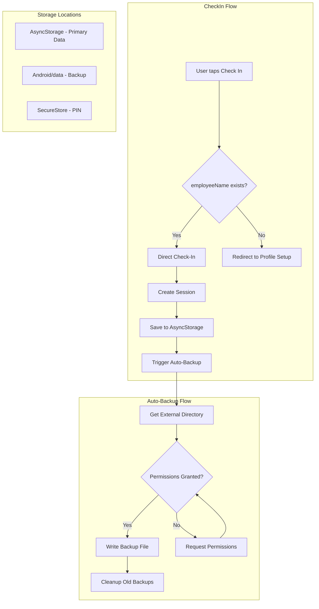

# Refactoring Plan: Check-In Process and Automatic Backup

## Overview
This plan outlines the refactoring needed to:
1. Auto-retrieve username from user profile during check-in (eliminating manual input)
2. Remove all UI buttons related to manual data backup and export
3. Implement automatic local storage persistence to Android external files directory

---

## Analysis Summary

### Current Check-In Implementation
**File**: [`CheckInModal.tsx`](mobile-app/src/components/CheckInModal.tsx)

- Lines 83-90: TextInput requires manual name entry with placeholder "Enter your name"
- Lines 49-65: `handleCheckIn` validates name is not empty before proceeding
- The modal shows even when `appData.employeeName` is already set
- Current logic: Pre-fills with `appData.employeeName || ''` but still shows the input

### User Profile Storage
**File**: [`AppContext.tsx`](mobile-app/src/context/AppContext.tsx)

- Lines 71-88: `appData` contains `employeeName`, `email`, `jobTitle`, `department`
- Lines 278-281: `setEmployeeName` persists name to state and storage
- Storage Key: `PHARMACY_ATTENDANCE_DATA_V2`

### Backup/Export UI Locations
**File**: [`ManageScreen.tsx`](mobile-app/src/screens/ManageScreen.tsx)

- Lines 239-259: "Data Management" card with "Export Data" button
- Lines 79-88: `handleExport` function
- Lines 41-46: ExportIcon component

### Current Permissions
**File**: [`app.json`](mobile-app/app.json)

- No Android storage permissions configured
- Only basic Expo configuration present

---

## Implementation Tasks

### Task 1: Refactor Check-In Process

#### 1.1 Modify CheckInModal.tsx
**Changes Required**:
- Remove the TextInput and manual name entry UI
- Auto-use `appData.employeeName` for check-in
- Simplify the modal to just confirm check-in action
- Handle first-time user scenario (no name set yet)

**Implementation Approach**:
```
Option A: Skip modal entirely if name exists, directly call checkIn
Option B: Show simplified confirmation modal without name input
```

**Recommended**: Option A - Direct check-in without modal for existing users

**Code Changes**:
1. Remove lines 83-90 (TextInput)
2. Update lines 49-65 (handleCheckIn) to not require name validation
3. Update lines 79-81 (modalMessage) to show different message
4. Consider navigating directly to check-in without showing modal if `appData.employeeName` exists

#### 1.2 Handle First-Time User Flow
- If `!appData.employeeName`, redirect to Profile setup or Onboarding
- Ensure name is captured during onboarding process

---

### Task 2: Remove Manual Backup/Export UI

#### 2.1 Modify ManageScreen.tsx
**Remove**:
- Lines 239-259: Entire "Data Management" card section
- Lines 79-88: `handleExport` function
- Lines 41-46: ExportIcon component (if unused elsewhere)
- Line 75: Remove `exportData` from destructured imports from useApp

#### 2.2 Clean Up AppContext.tsx (Optional)
**Keep for internal use**:
- `exportData` function (lines 455-555) - may be needed for automatic backup
- `importData` function (lines 557-624) - may be needed for data recovery

---

### Task 3: Implement Automatic Local Storage Persistence

#### 3.1 Update app.json Permissions
**Add Android permissions**:
```json
{
  "expo": {
    "android": {
      "permissions": [
        "WRITE_EXTERNAL_STORAGE",
        "READ_EXTERNAL_STORAGE"
      ]
    }
  }
}
```

**Note**: For Android 10+ (API 29+), scoped storage is used. We can write to app-specific directory without special permissions:
- Path: `Android/data/com.yourpackage.sas-app/files/`

#### 3.2 Create Auto-Backup Utility
**New File**: `src/utils/autoBackup.ts`

**Features**:
- Automatic save to external files directory on data changes
- Background backup without user interaction
- Timestamped backup files
- Cleanup of old backups (keep last N backups)

**Implementation**:
```typescript
// Key functions needed:
- requestStoragePermissions(): Promise<boolean>
- getExternalBackupDirectory(): Promise<string>
- saveBackupToFile(data: AppData): Promise<boolean>
- scheduleAutoBackup(data: AppData): void
- cleanupOldBackups(): Promise<void>
```

#### 3.3 Integrate with AppContext
**Modify AppContext.tsx**:
- Add auto-backup trigger in `saveData` function
- Call auto-backup after each data modification
- Add backup status to context state

**Changes**:
1. Import auto-backup utility
2. Modify `saveDataDirect` (lines 299-310) to trigger auto-backup
3. Add `lastBackupTime` to state
4. Add `backupStatus` to track backup health

#### 3.4 Add expo-file-system Configuration
**Already installed**: `expo-file-system: ~19.0.21`

**Additional setup needed**:
- Configure `FileSystem.documentDirectory` for internal storage
- Use `FileSystem.externalDirectory` for Android external storage

---

## File Change Summary

| File | Changes |
|------|---------|
| `CheckInModal.tsx` | Remove name input, auto-use stored name |
| `ManageScreen.tsx` | Remove Data Management card and export button |
| `AppContext.tsx` | Add auto-backup integration |
| `app.json` | Add Android storage permissions |
| `src/utils/autoBackup.ts` | New file - auto-backup implementation |

---

## Architecture Diagram



---

## Dependencies

**Existing** (no new packages needed):
- `expo-file-system` - Already installed, used for file operations
- `expo-secure-store` - Already installed, used for PIN storage
- `@react-native-async-storage/async-storage` - Already installed

**Potential additions**:
- None required for basic implementation

---

## Testing Considerations

1. **Check-In Flow**:
   - Test with existing user (name already set)
   - Test with new user (no name set)
   - Verify session creation works correctly

2. **Auto-Backup**:
   - Test permission request flow
   - Verify file creation in external directory
   - Test backup cleanup functionality
   - Test on different Android versions (scoped storage differences)

3. **Removed Features**:
   - Verify no broken references to removed export functionality
   - Ensure data can still be recovered if needed

---

## Risk Assessment

| Risk | Impact | Mitigation |
|------|--------|------------|
| Permission denial on Android | Auto-backup fails silently | Keep AsyncStorage as primary, backup is secondary |
| Scoped storage changes in Android 11+ | May affect file access | Use app-specific directory which doesn't require permissions |
| First-time user confusion | Cannot check in without name | Redirect to profile setup with clear guidance |

---

## Implementation Order

1. **Phase 1**: Refactor Check-In Process
   - Modify CheckInModal.tsx
   - Test check-in flow

2. **Phase 2**: Remove Manual Backup UI
   - Update ManageScreen.tsx
   - Remove unused code

3. **Phase 3**: Implement Auto-Backup
   - Update app.json permissions
   - Create autoBackup.ts utility
   - Integrate with AppContext.tsx
   - Test backup functionality

---

## Clarified Requirements

**Confirmed Requirements:**
1. **Single-User Application**: Only one person uses the app - the name stored in Profile is the only name
2. **Automatic Backup**: Instant - happens immediately on every data change
3. **Name Management**: Name is set/edited in Profile screen only - no name input needed in check-in modal

**Implementation Decisions:**
1. **Check-In Modal**: Remove name input entirely - just show a simple confirmation or remove modal completely
2. **First-Time Users**: If no name is set, redirect to Profile screen to set up name before check-in
3. **Backup**: Instant backup on every data change (no scheduling needed)
4. **Backup Retention**: Keep last 5 backup files to prevent storage bloat
