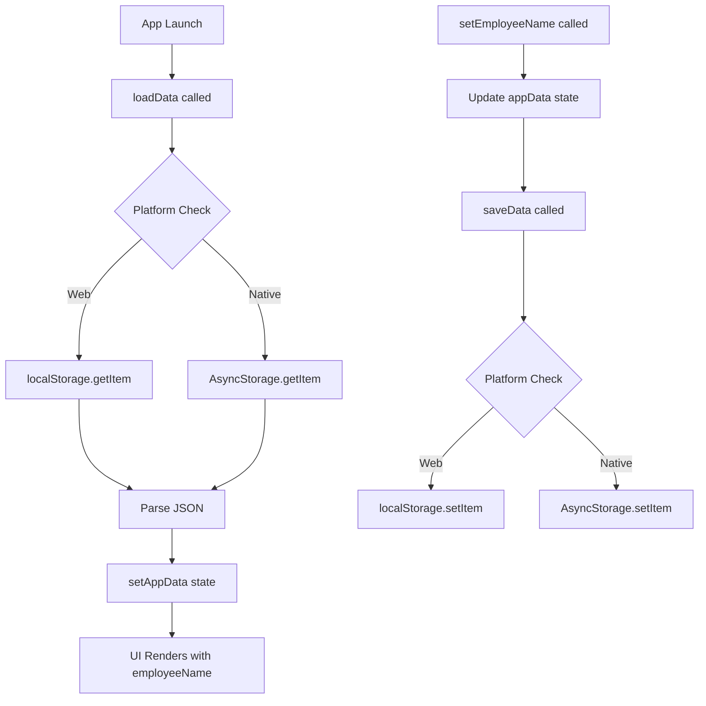

# Codebase Refactoring Analysis

## Executive Summary

This analysis examines the current implementation of the attendance tracking application to guide refactoring for:
1. Auto-retrieving username from user profile during check-in
2. Removing manual backup/export buttons
3. Implementing automatic background backup to Android/data directory

---

## 1. Check-In Modal Username Collection

### Current Implementation

**File:** [`CheckInModal.tsx`](mobile-app/src/components/CheckInModal.tsx:29)

The check-in modal currently implements a **manual prompt** for username collection:

```typescript
// Line 32: Name state initialized from appData or empty string
const [name, setName] = useState(appData.employeeName || '');

// Lines 83-90: TextInput for manual name entry
<TextInput
  style={styles.nameInput}
  placeholder="Enter your name"
  placeholderTextColor={colors.textMuted}
  value={name}
  onChangeText={setName}
  autoFocus
/>
```

### Username Flow

1. **Initialization** (Line 32): Pre-fills with `appData.employeeName` if available
2. **Validation** (Lines 50-53): Requires non-empty name before check-in
3. **Storage** (Lines 56-58): Saves name via `setEmployeeName()` only if not already set
4. **Check-in** (Line 59): Calls `checkIn()` to create session

### Key Code Locations for Modification

| Location | Line(s) | Purpose | Modification Needed |
|----------|---------|---------|---------------------|
| [`CheckInModal.tsx`](mobile-app/src/components/CheckInModal.tsx:32) | 32 | Name state initialization | Auto-use existing name |
| [`CheckInModal.tsx`](mobile-app/src/components/CheckInModal.tsx:83) | 83-90 | TextInput component | Remove or conditionally hide |
| [`CheckInModal.tsx`](mobile-app/src/components/CheckInModal.tsx:50) | 50-53 | Name validation | Skip if name exists in profile |
| [`CheckInModal.tsx`](mobile-app/src/components/CheckInModal.tsx:56) | 56-58 | setEmployeeName call | Remove redundant save |

---

## 2. User Profile Structure & Username Storage

### AppData Interface

**File:** [`types/index.ts`](mobile-app/src/types/index.ts:34)

```typescript
export interface AppData {
  sessions: Session[];
  employeeName: string;    // ← Username stored here
  email: string;
  jobTitle: string;
  department: string;
  onboardingCompleted: boolean;
  onboardingProgress: OnboardingProgress;
  appSettings: AppSettings;
}
```

### Context Implementation

**File:** [`AppContext.tsx`](mobile-app/src/context/AppContext.tsx:70)

| Function | Lines | Description |
|----------|-------|-------------|
| [`setEmployeeName()`](mobile-app/src/context/AppContext.tsx:278) | 278-281 | Updates `employeeName` in state and persists to storage |
| [`loadData()`](mobile-app/src/context/AppContext.tsx:138) | 138-241 | Loads app data including `employeeName` from AsyncStorage |
| [`saveData()`](mobile-app/src/context/AppContext.tsx:243) | 243-254 | Persists app data to AsyncStorage |

### Storage Keys

**File:** [`AppContext.tsx`](mobile-app/src/context/AppContext.tsx:52)

```typescript
const STORAGE_KEY = 'PHARMACY_ATTENDANCE_DATA_V2';
```

### Data Persistence Flow



---

## 3. Manual Backup/Export UI Buttons

### ProfileScreen.tsx

**File:** [`ProfileScreen.tsx`](mobile-app/src/screens/ProfileScreen.tsx:65)

**Finding:** No backup/export buttons found. This screen only contains:
- Personal information editing (name, email, job title, department)
- Activity summary display

### ManageScreen.tsx

**File:** [`ManageScreen.tsx`](mobile-app/src/screens/ManageScreen.tsx:74)

**Export Button Found** - Lines 251-258:

```typescript
<TouchableOpacity
  style={[styles.actionButton, styles.actionButtonFull]}
  onPress={handleExport}
  activeOpacity={0.8}
>
  <ExportIcon size={20} />
  <Text style={styles.actionButtonPrimaryText}>Export Data</Text>
</TouchableOpacity>
```

**Handler Function** - Lines 79-88:

```typescript
const handleExport = async () => {
  const data = await exportData();
  if (data) {
    Alert.alert('Success', 'Data exported successfully', [
      { text: 'OK', onPress: () => {} }
    ]);
  } else {
    Alert.alert('Error', 'Failed to export data');
  }
};
```

### UI Button Locations Summary

| Screen | Button | Location | Action |
|--------|--------|----------|--------|
| ProfileScreen | None | N/A | N/A |
| ManageScreen | Export Data | Lines 251-258 | Calls `exportData()` from context |

---

## 4. Current Data Persistence Approach

### Storage Mechanism

**File:** [`AppContext.tsx`](mobile-app/src/context/AppContext.tsx:99)

```typescript
// Platform-aware storage abstraction
const getStorageItem = async (key: string): Promise<string | null> => {
  if (Platform.OS === 'web') {
    return localStorage.getItem(key);
  } else {
    return await AsyncStorage.getItem(key);
  }
};

const setStorageItem = async (key: string, value: string): Promise<boolean> => {
  if (Platform.OS === 'web') {
    localStorage.setItem(key, value);
    return true;
  } else {
    await AsyncStorage.setItem(key, value);
    return true;
  }
};
```

### Export Function Implementation

**File:** [`AppContext.tsx`](mobile-app/src/context/AppContext.tsx:455)

The [`exportData()`](mobile-app/src/context/AppContext.tsx:455) function (Lines 455-555):

1. Creates timestamped JSON backup
2. For **Web**: Copies to clipboard
3. For **Native**: 
   - Writes to cache directory
   - Uses `expo-sharing` to share file
   - Falls back to clipboard on error

### Import Function Implementation

**File:** [`AppContext.tsx`](mobile-app/src/context/AppContext.tsx:557)

The [`importData()`](mobile-app/src/context/AppContext.tsx:557) function (Lines 557-624):

1. Uses `expo-document-picker` to select JSON file
2. Validates backup file format
3. Merges imported data into app state
4. Persists to AsyncStorage

### Current Backup Format

```json
{
  "exportDate": "ISO timestamp",
  "exportTimestamp": number,
  "version": "2.0",
  "pharmacyName": "Pharmacy Attendance System",
  "employeeName": "string",
  "email": "string",
  "jobTitle": "string",
  "department": "string",
  "summary": {
    "totalSessions": number,
    "activeSessions": number
  },
  "sessions": [...],
  "rawData": {...}
}
```

---

## 5. Android Permissions for Automatic Local Storage

### Current Permissions Configuration

**File:** [`app.json`](mobile-app/app.json:1)

```json
{
  "expo": {
    "android": {
      "adaptiveIcon": {
        "foregroundImage": "./assets/adaptive-icon.png",
        "backgroundColor": "#ffffff"
      },
      "edgeToEdgeEnabled": true
    }
  }
}
```

**Current State:** No storage permissions configured.

### Required Permissions for Android External Storage

#### For Android 9 and below (API 28 and lower)

```json
{
  "expo": {
    "android": {
      "permissions": [
        "READ_EXTERNAL_STORAGE",
        "WRITE_EXTERNAL_STORAGE"
      ]
    }
  }
}
```

#### For Android 10 (API 29)

Uses **Scoped Storage** - apps can only access:
- Their own app-specific directory
- Media files they created
- Files in the Downloads folder they created

#### For Android 11+ (API 30+)

```json
{
  "expo": {
    "android": {
      "permissions": [
        "MANAGE_EXTERNAL_STORAGE"
      ]
    }
  }
}
```

**Note:** `MANAGE_EXTERNAL_STORAGE` requires special justification for Google Play Store approval.

### Recommended Approach: App-Specific External Storage

For automatic background backup without special permissions, use:

```
Android/data/com.yourpackage.sas-app/files/
```

This directory:
- Does not require special permissions
- Is accessible via `expo-file-system` with `documentDirectory` or `externalDirectory`
- Persists after app updates
- Is deleted on app uninstall (acceptable for backup purposes)

### Expo FileSystem API

**Current imports in AppContext.tsx:**

```typescript
import * as FileSystem from 'expo-file-system';
```

**Available directories:**
- `FileSystem.documentDirectory` - App's internal storage
- `FileSystem.cacheDirectory` - Temporary cache (can be cleared)
- `FileSystem.externalDirectory` - External storage (requires permissions on older Android)

---

## 6. Refactoring Recommendations

### Task 1: Auto-Retrieve Username During Check-In

**Approach:** Modify CheckInModal to skip name prompt if already set.

**Files to modify:**
1. [`CheckInModal.tsx`](mobile-app/src/components/CheckInModal.tsx:29)

**Implementation:**

```typescript
// Option A: Skip modal entirely if name exists
const handleCheckIn = async () => {
  const nameToUse = appData.employeeName || name.trim();
  if (!nameToUse) {
    Alert.alert('Error', 'Please enter your name.');
    return;
  }
  // ... rest of logic
};

// Option B: Conditionally render TextInput
{!appData.employeeName && (
  <TextInput
    style={styles.nameInput}
    placeholder="Enter your name"
    value={name}
    onChangeText={setName}
    autoFocus
  />
)}
```

### Task 2: Remove Manual Backup/Export Buttons

**Files to modify:**
1. [`ManageScreen.tsx`](mobile-app/src/screens/ManageScreen.tsx:239) - Remove "Data Management" card (Lines 239-259)
2. [`AppContext.tsx`](mobile-app/src/context/AppContext.tsx:455) - Keep `exportData()` for internal use, remove from UI

**Code to remove from ManageScreen.tsx:**

```typescript
// Lines 239-259: Remove entire "Data Management" card
<View style={styles.card}>
  <View style={styles.cardHeader}>
    <View style={[styles.cardIconContainer, styles.cardIconContainerData]}>
      <ExportIcon size={20} />
    </View>
    <Text style={styles.cardTitle}>Data Management</Text>
  </View>
  <Text style={styles.cardDescription}>
    Export your attendance data...
  </Text>
  <TouchableOpacity
    style={[styles.actionButton, styles.actionButtonFull]}
    onPress={handleExport}
    activeOpacity={0.8}
  >
    <ExportIcon size={20} />
    <Text style={styles.actionButtonPrimaryText}>Export Data</Text>
  </TouchableOpacity>
</View>
```

### Task 3: Implement Automatic Background Backup

**Approach:** Create automatic backup service that triggers on data changes.

**Files to create/modify:**
1. Create new file: `src/utils/autoBackup.ts`
2. Modify: [`AppContext.tsx`](mobile-app/src/context/AppContext.tsx:243) - Add backup trigger in `saveData()`
3. Modify: [`app.json`](mobile-app/app.json:19) - Add permissions

**Implementation outline:**

```typescript
// src/utils/autoBackup.ts
import * as FileSystem from 'expo-file-system';
import { Platform } from 'react-native';

const BACKUP_DIR = FileSystem.documentDirectory + 'backups/';
const MAX_BACKUPS = 5;

export async function performAutoBackup(data: string): Promise<boolean> {
  if (Platform.OS === 'web') return false;
  
  try {
    // Ensure backup directory exists
    const dirInfo = await FileSystem.getInfoAsync(BACKUP_DIR);
    if (!dirInfo.exists) {
      await FileSystem.makeDirectoryAsync(BACKUP_DIR, { intermediates: true });
    }
    
    // Create timestamped backup
    const timestamp = new Date().toISOString().replace(/[:.]/g, '-');
    const backupPath = `${BACKUP_DIR}auto_backup_${timestamp}.json`;
    
    await FileSystem.writeAsStringAsync(backupPath, data);
    
    // Clean old backups
    await cleanOldBackups();
    
    return true;
  } catch (error) {
    console.error('Auto backup failed:', error);
    return false;
  }
}

async function cleanOldBackups(): Promise<void> {
  const files = await FileSystem.readDirectoryAsync(BACKUP_DIR);
  const backupFiles = files
    .filter(f => f.startsWith('auto_backup_'))
    .sort()
    .reverse();
  
  // Delete old backups beyond MAX_BACKUPS
  for (let i = MAX_BACKUPS; i < backupFiles.length; i++) {
    await FileSystem.deleteAsync(`${BACKUP_DIR}${backupFiles[i]}`);
  }
}
```

**AppContext.tsx modification:**

```typescript
// In saveData function, add:
import { performAutoBackup } from '../utils/autoBackup';

const saveData = async (): Promise<boolean> => {
  try {
    const dataString = JSON.stringify(appData);
    const success = await setStorageItem(STORAGE_KEY, dataString);
    
    // Trigger automatic backup on successful save
    if (success && Platform.OS !== 'web') {
      await performAutoBackup(dataString);
    }
    
    return success;
  } catch (error) {
    console.error('Error saving data:', error);
    return false;
  }
};
```

**app.json modification:**

```json
{
  "expo": {
    "android": {
      "permissions": [
        "READ_EXTERNAL_STORAGE",
        "WRITE_EXTERNAL_STORAGE"
      ]
    }
  }
}
```

---

## 7. Summary of Required Changes

| Task | File | Change Type | Complexity |
|------|------|-------------|------------|
| Auto-retrieve username | `CheckInModal.tsx` | Modify | Low |
| Remove export button | `ManageScreen.tsx` | Delete code | Low |
| Add auto-backup | `AppContext.tsx` | Modify | Medium |
| Create backup utility | `src/utils/autoBackup.ts` | New file | Medium |
| Add permissions | `app.json` | Modify | Low |

---

## 8. Dependencies

Current dependencies in use (from existing imports):
- `expo-file-system` - Already imported in AppContext.tsx
- `expo-sharing` - Already imported in AppContext.tsx
- `@react-native-async-storage/async-storage` - Already in use

No new dependencies required for the refactoring tasks.
